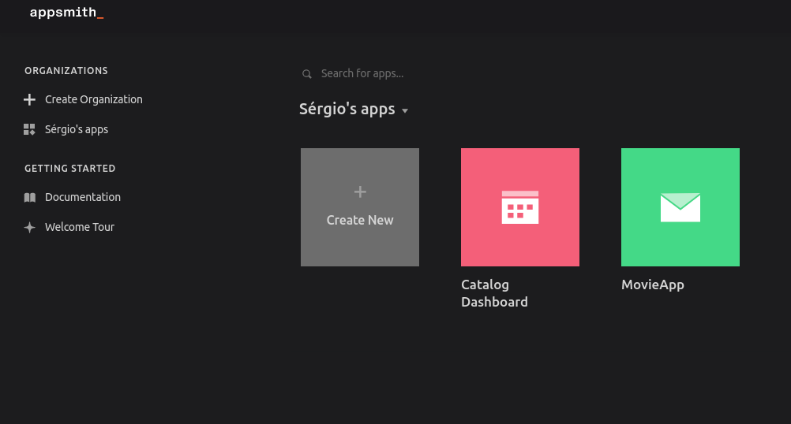
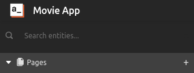
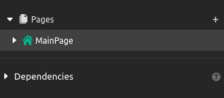
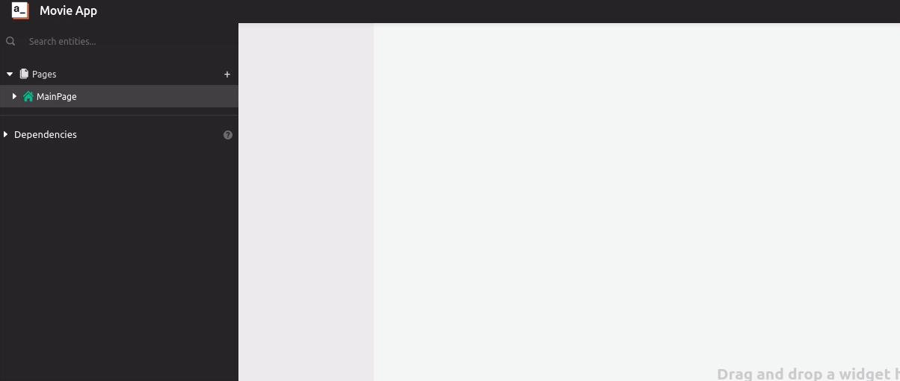
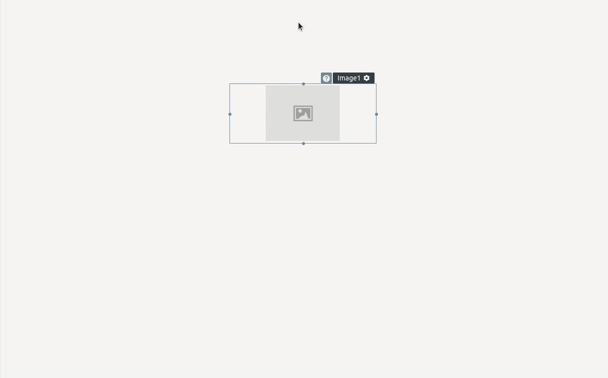

# Building a Movie App

In this tutorial, I'll show you step by step how to create an application for exploring a catalog of movies. It will be possible to choose a movie from the catalog and click on it to access its details and also watch its trailer. We will also be able to bookmark a movie and access our list of bookmarked movies. This tutorial covers many of Appsmith's functionalities, we will connect it with an external API (THE MOVIE DB), and also with a Postgres database, where the bookmarked movies are going to be saved. Let's begin.

## Setting up

First, let's go to our dashboard and create a new Appsmth application by simply clicking on the `Create New` button.

&nbsp;

Now we have a totally new app. Let's start renaming our app and our first page.

1. Double click at `Untitled application 1` and change it to `Movie App`. As you may remember from the Appsmith tutorial, you do not need to press anything to save it, Appsmith does it automatically for you.

&nbsp;

2. Now let's double click on the page and change its name to `MainPage`.

&nbsp;

Awesome, we already changed our app's name and gave a name to the first page. Now let's add a big image at the top of our first page. This image is going to be like a backdrop from a movie, and it's going to be the first thing that users are going to see as soon as they access our app. To add an image to our page we can simply:

1. Click on the `MainPage` to access the dropdown
2. Click on `+` at the `Widget` section
3. Then click and drag the image widget to our app

&nbsp;

4. We can resize it and make it a little bit bigger, that way it will take the whole width of the page.

&nbsp;

Done. We have this image but it's not showing anything yet. We are about to fix that, let's connect our application with [The Movie DB API](https://developers.themoviedb.org/3/getting-started/introduction).