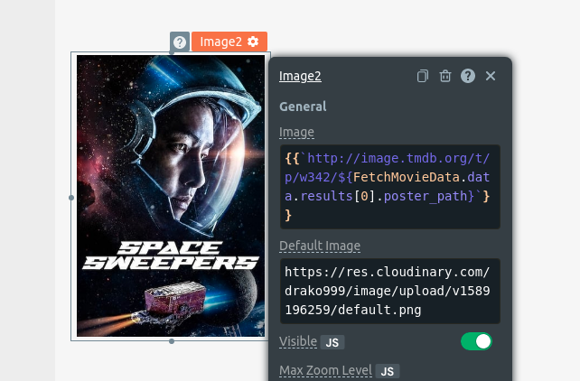

## Connecting with the API

First, we need to set up our credentials in order to have access to the Movie Database.

1. Go to the [signup](https://www.themoviedb.org/signup) page and create a new account.

2. After registering within the Movie DB we can sign in and go to the [api](https://www.themoviedb.org/settings/api) page to have access to your credentials.

3. Now we need to copy the `API Read Access Token (v4 auth)`. This is the API key that we are going to use to have access to The Movie Database.

&nbsp;

4. Now back to our app, let's navigate to `MainPage` and then click on the `+` on the `APIs` sections.

5. Then we need to click on `Create new`.

&nbsp;

6. Let's first rename the request to `FetchMovieData`.

7. We are going to add our API key to the header object. The property name is `Authorization` and for the value, we need to first write `Bearer` and then add a single space before pasting the API key.

&nbsp;

8. For the request address, we wanna fetch the most popular movies. For such request, we need to use this address `https://api.themoviedb.org/3/movie/popular`. If you wanna check all available requests, you check the documentation [here](https://developers.themoviedb.org/3/movies/get-popular-movies).

9. Then we can click on `run` and check if everything is right.

&nbsp;

That's it, we just connected our app with the API. The returned payload it's an array with 20 movie objects. In each object, we can find several details from the movie, like title, movie overview, release date, a path to the movie cover, and many more. 
To display a movie backdrop in our image we can use the `backdrop_path` property. We also need to use a predefined URL for fetching images: `http://image.tmdb.org/t/p/<image-size>/<image-path>`.

Let's update the widget properties from the image. We can use JS to access the first object inside the array. We will end up having something like this:

```JS
{{`http://image.tmdb.org/t/p/original/${FetchMovieData.data.results[0].backdrop_path}`}}
```

&nbsp;

And the backdrop image is being properly displayed.

&nbsp;

## Adding Movie Covers

Now let's start to build our catalog of movies.

1. At the `MainPage` navigate to `Widgets` and click on the `+` symbol.
2. Click on the image widget and drag it to our page.
3. We now are going to edit its properties and for the image URL we need to use JS again to access the `poster_path` property from the movie object at the position `0` within the array. Again, we need to use the predefined URL from The Movie Database, but instead of the path `original` that was used in the movie backdrop, we are going to use another value. The reason for this is because this path is related to the size of the image, and for this case, we need a smaller image than the one we used in the movie backdrop. The end result is something like this:

```JS
{{`http://image.tmdb.org/t/p/w342/${FetchMovieData.data.results[0].poster_path}`}}
```

&nbsp;

We can see our cover image now

4. Now let's make sure that this image is only visible when a movie object exists within the array at position 0. We can achieve that by inserting JS at the `visible` widget property from the image. Let's click on the `JS` button that lives at the right side of the `Visible` property keyword and then use this code here:

```JS
{{!!FetchMovieData.data.results[0]}}
```

&nbsp;

Now let's add a text to display the movie title.

1. At the `MainPage` navigate to Widgets and click on the `+` symbol.
2. Click on the text widget and drag it to our page, just below the movie image cover.
3. We now can access the movie object at position 0 within the array to display the movie title.
```JS
{{FetchMovieData.data.results[0].title}}
```
4. Let's also edit the `Text Align` property and change it to `center`.
5. Finally we are going to edit the `Visible` property again and use the same code we used before in the cover image. This way, if the movie object does not exist at position 0, this text will not be visible.

&nbsp;

Awesome, we now have our first movie cover with the movie title bellow it. But what about the other details about this movie? Are we going to show them? Let's do that right away.