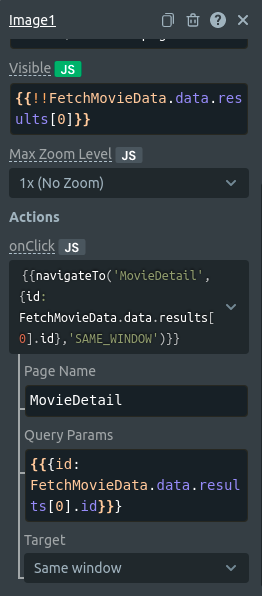
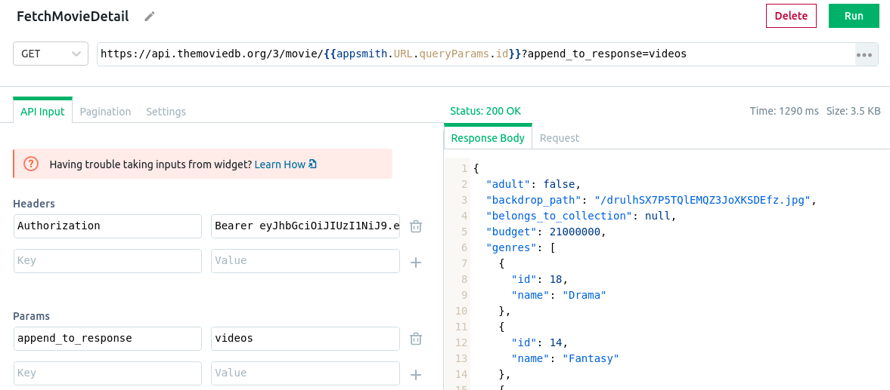
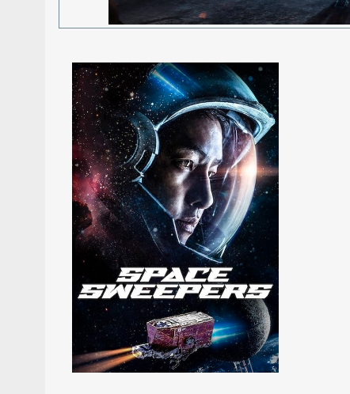
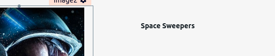
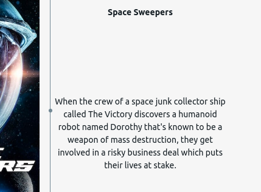
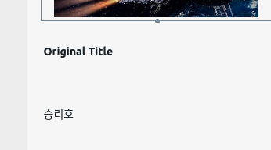
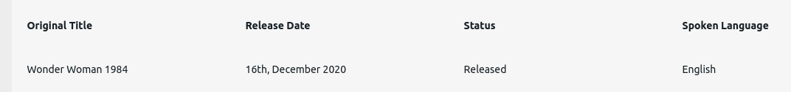
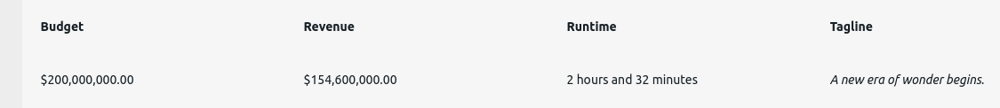
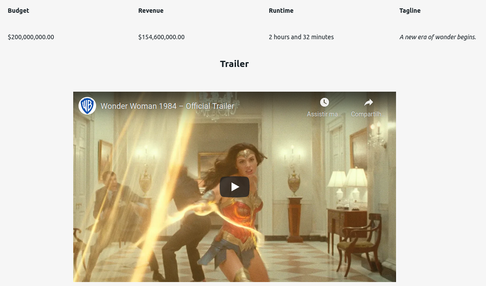

## Building Movie Detail Page

Let's create a new page:

1. Click on the `+` at the pages section within the left menu.
2. A new page will be created. Let's double click on `Page1` and rename it to `MovieDetail`.

With the `MovieDetail` page created we now need to set up the API call. Since we are not in `MainPage` anymore, we do not have access to the object returned from the API call. We need to create a new API call and this time we are going to use a different one. The Movie DB API supports a request to fetch details from a specific movie. We only need to pass the movie id as a query parameter. So first let's make the movie cover at the `MainPage` navigates to the `MovieDetail` and bring the movie id in the process.

1. Navigate to the `MainPage`
2. Open the widget properties from the movie cover image.
3. On actions we are going to click on the dropdown and select the option `Navigate To`.
4. On `Page Name` we are going to add `MovieDetail`.
5. For the `Query Params` we are going to use JS to pass the movie id.
```JS
{{{id: FetchMovieData.data.results[0].id}}}
```
6. Lastly for the `Target` we can select the `Same window` option.

&nbsp;

We are passing the movie id value to the `MovieDetail` page. Now let's configure the API call.

1. Navigate to the `MovieDetail` page.
2. On the APIs section click at the `+`.
3. Select the option `Create new`.
4. We can rename it to `FetchMovieDetail`.
5. The URL to fetch movie detail is: `https://api.themoviedb.org/3/movie/<movie-id>`. We are going to use JS to access the id value that is being passed to this page as a query param. We can access the param with the code: `appsmith.URL.queryParams.id`. The resulting URL is:
```JS
https://api.themoviedb.org/3/movie/{{appsmith.URL.queryParams.id}}
```

6. We need to set the Authorization object within the header, the same way we did in the API call from the `MainPage`.

7. Lastly in the `Params` section, we are going to add one to include trailer info in the output payload. We can simply add a param `append_to_response` and as a value, we add `videos`. 

&nbsp;

We finish adding the API call for our `MovieDetail` page. Now let's add more widgets to display detailed information about the movie.

#### Backdrop Image

1. Navigate to `MovieDetail` Widgets.
2. Click on the `+`.
3. Add an image to be the movie backdrop, just like we did at the `MainPage`.
4.  Let's edit the image widget properties and add a similar JS code to the backdrop image from the `MainPage`. But this time we are going to access the API for this current page. The end result is something like this:
```JS
{{`http://image.tmdb.org/t/p/original/${FetchMovieDetail.data.backdrop_path}`}}
```

#### Poster Image

1. Navigate to `MovieDetail` Widgets.
2. Click on the `+`.
3. Add an image to be the movie poster, just like we did at the `MainPage`.
4.  Let's edit the image widget properties and add the following JS code:
```JS
{{`http://image.tmdb.org/t/p/w342/${FetchMovieDetail.data.poster_path}`}}
```

&nbsp;

#### Movie Title Label

1. Navigate to `MovieDetail` Widgets.
2. Click on the `+`.
3. Add a text widget on the right side of the movie cover.
4. Let's edit the text widget properties and add the following JS code:
```JS
{{FetchMovieDetail.data.title}}
```

&nbsp;

#### Movie Overview

1. Navigate to `MovieDetail` Widgets.
2. Click on the `+`.
3. Add a text widget at the right side of the movie cover and below the movie title text.
4. Let's edit the text widget properties and add the following JS code:
```JS
{{FetchMovieDetail.data.overview}}
```

&nbsp;

#### Movie Original Title

1. Navigate to `MovieDetail` Widgets.
2. Click on the `+`.
3. Add a text widget below the movie cover. This is going to be just a label. 
4. Let's edit the text widget properties and add the value `Original Title`.
5. Now we can add a new text widget to be the actual title. We can place it below the `Original Title` label. 
6. We can add the following JS code:
```JS
{{FetchMovieDetail.data.original_title}}
```

&nbsp;

#### Movie Release Date

1. Navigate to `MovieDetail` Widgets.
2. Click on the `+`.
3. Add a text widget at the right side of the `Original Title` label. 
4. Let's edit the text widget property and add the value `Release Date`.
5. Now we can add a new text widget to be the actual date. We can place it below the `Release Date` label.
6. The release date it's not formatted. But we can use momement.js to format the date. Thankfully Appsmith comes with the moment.js dependency and supports all its methods. Another problem that we may have is that in some cases the `release_date` can have a null value since the date could not be informed yet. So when the value is not available, we are going to show another message.
7. We can add the following JS code:
```JS
{{FetchMovieById.data.release_date ? moment(FetchMovieById.data.release_date).format("Do, MMMM YYYY") : 'Unknown'}}
```

#### Movie Status

1. Navigate to `MovieDetail` Widgets.
2. Click on the `+`.
3. Add a text widget at the right side of the `Release Date` label. 
4. Let's edit the text widget properties and add the value `Status`.
5. Now we can add a new text widget to be the actual value of the status property. We can place it below the `Status` label.
6. We can add the following JS code:
```JS
{{FetchMovieById.data.status ? FetchMovieById.data.status : "Unknown"}}
```

#### Movie Spoken Language

1. Navigate to `MovieDetail` page Widgets.
2. Click on the `+`.
3. Add a text widget at the right side of the `Status` label. 
4. Let's edit the text widget properties and add the value `Spoken Language`.
5. Now we can add a new text widget to be the actual value of the language property. We can place it below the `Spoken Language` label.
6. We can add the following JS code:
```JS
{{
  FetchMovieById.data.spoken_languages[0].name 
  ? FetchMovieById.data.spoken_languages[0].name 
  : "Unknown"
}}
``` 

Our application should look like something like this:

&nbsp;

#### Movie Budget

1. Navigate to `MovieDetail` page Widgets.
2. Click on the `+`.
3. Add a text widget below the `Original Title` text. 
4. Let's edit the text widget properties and add the value `Budget`.
5. Now we can add a new text widget to be the actual budget. We can place it below the `Budget` label.
6. We can add the following JS code:
```JS
{{FetchMovieById.data.budget ? new Intl.NumberFormat('en-US', {
  style: 'currency',
  currency: 'USD'}).format(FetchMovieById.data.budget) : 'Unknown'}}
```
Here I'm using a method from the [Intl object](https://developer.mozilla.org/en-US/docs/Web/JavaScript/Reference/Global_Objects/Intl) to properly format the currency string

#### Movie Revenue

1. Navigate to `MovieDetail` page Widgets.
2. Click on the `+`.
3. Add a text widget at the right side of the `Budget` label. 
4. Let's edit the text widget properties and add the value `Revenue`.
5. Now we can add a new text widget to be the actual revenue. We can place it below the `Revenue` label.
6. We can add the following JS code:
```JS
{{FetchMovieById.data.revenue ? new Intl.NumberFormat('en-US', {
  style: 'currency',
  currency: 'USD'}).format(FetchMovieById.data.revenue) : "Unknown"}}
```

#### Movie Runtime

1. Navigate to `MovieDetail` page Widgets.
2. Click on the `+`.
3. Add a text widget at the right side of the `Revenue` label. 
4. Let's edit the text widget properties and add the value `Runtime`.
5. Now we can add a new text widget to be the actual revenue. We can place it below the `Runtime  ` label.
6. We can add the following JS code:
```JS
{{FetchMovieById.data.runtime ? moment().hours(0).minutes(FetchMovieById.data.runtime).format("h [hours and] mm [minutes]") : 'Unknown'}}
```

#### Movie Tagline

1. Navigate to `MovieDetail` page Widgets.
2. Click on the `+`.
3. Add a text widget at the right side of the `Runtime` label. 
4. Let's edit the text widget properties and add the value `Tagline`.
5. Now we can add a new text widget to be the actual revenue. We can place it below the `Tagline  ` label.
6. We can add the following JS code:
```JS
{{FetchMovieById.data.tagline ? FetchMovieById.data.tagline.italics() : 'Unknown'}}
```

Here I'm using the italic method of the String class to give a different appeal to the movie.

By now this second row should look like this way:

&nbsp;

#### Movie Trailer

1. Navigate to `MovieDetail` page Widgets.
2. Click on the `+`.
3. Add a text widget below the other movie details and rename it to `Trailer`.
4. We can edit the text widget properties and change the text-align to the center.
5. We also need to edit the Visible property and add a JS code since we do not want the trailer label to appears when a trailer value it's not available. We can add:
```JS
{{!!FetchMovieById.data.videos.results[0]}}
```
6. Now let's click on the `+` again.
7. Click on the video widget and drag it to below the trailer label.
8. We should resize it a make it a lit bit bigger than the default size.
9. We need to edit the trailer widget properties and set up the trailer URL. Here we will need to use two strings, the main URL from Youtube and the value of the trailer object. We will have something like this.

```JS
{{`https://www.youtube.com/watch?v=${FetchMovieById.data.videos.results[0].key}`}}
```

10. The `Visible` property also needs to be edited. The trailer should only be visible if the trailer object exists
```JS
{{!!FetchMovieById.data.videos.results[0]}}
```

&nbsp;

We Just finished creating our `MovieDetail` page.