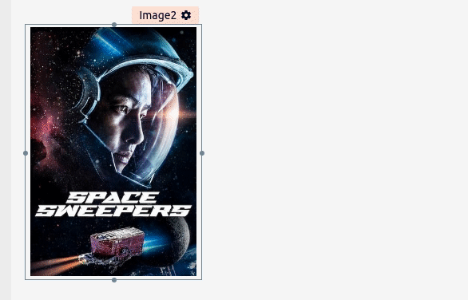
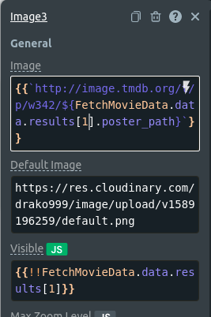
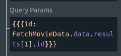
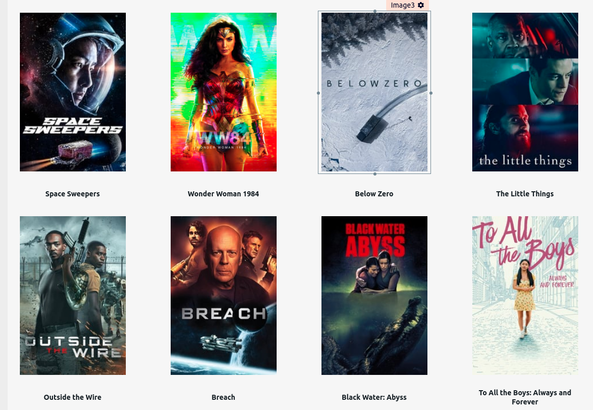

## Finishing Movie Catalogue

Let's take a look at our MainPage. Here we are supposed to build a catalog of movies, but right now we only have one movie. We know that the API returns an array of 20 movie objects. So let's take advantage of that by adding 19 images and title labels to display all 20 movies total. To make this process easy, we can simply keep copying and pasting both the image and the text label to reach the number that we want.

1. Navigate to the MainPage
2. Access the properties of the cover image widget and click on the copy button.

&nbsp;

3. After that you can simply type `ctrl` + `v` on your keyboard. A copy from the cover image widget will appear.
4. We need to edit the properties from the copied widget and instead of accessing the first item within the array `[0]`, we are going to access the second `[1]`. For each copy we need to edit all 3 properties `Image url`, `Visible`, and `QueryParams`, and update accordingly.

&nbsp;
&nbsp;

5. Now we need to repeat this process until we have both 20 images and 20 text labels. Remember that the movie objects within the array go from 0 to 19. This means that the first movie is on position `[0]`, the second is on position `[1]`, the third is on position `[2]` and so goes on. For the text label, we can use the same process, copy, paste it, and then edit the `Text` and `Visible` property to change the position from the movie object within the array. After doing that we will have this output:

&nbsp;

We finish the catalog. Now we can simply click on each of these movie covers to access a detail page containing information about them. Now let's make this catalog more powerful by adding a pagination functionality.