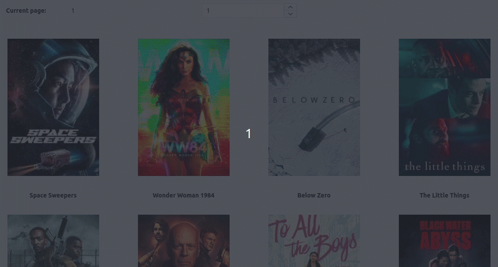

## Adding Pagination to the MainPage

The API request that we are making at the MainPage supports pagination. The payload response gives us the total number of pages and the number of the current page.

#### Page Info
Let's add 2 label texts and 2 text bodies to show both the total number of pages and the number of the current page.

1. Navigate to the MainPage
2. Click on the `+`.
3. Add a text widget to the MainPage.
4. Edit the text property and change it to `Number of pages:`
5. Now click on the `+` again.
6. Add another text widget to the right of the `Number of pages:`.
7. Edit its properties and change the text value to a number of pages object that is being returned from the API call.
```JS
{{FetchMovieData.data.total_pages}}
```

&nbsp;

8. Now let's repeat this process for the current page
10. Click on the `+`
11. Add a text widget
12. Edit the text property and change it to `Current page:`
13. Now click on the `+` again
14. Add another text widget to the right of the `Current page:`
```JS
{{FetchMovieData.data.page}}
```

&nbsp;

We already know the current page and the total number of pages. Now we need to find a way to navigate between pages. First, let's add an input widget to the MainPage. It will be through this input that we will control on which page we are.

1. Navigate to the `Widgets` at the `MainPage`
2. Click on the `+`
3. Click and drag an input widget to the `MainPage`
4. Open the properties from the input widget
5. First let's change the name, we can click on the `Input1` and rename it to `CurrentPageInput`
6. Click at the `Data Type` property and select `Number`
7. At the `Default Text` put the value of `1`
8. At the regex property we should allow only numbers, therefore we can use this value `^\d*[1-9]\d*$`
9. Now on the `onTextChanged` we are going to add a JS code. Here we want to make the API run again with the updated page number. We simply give a command for the API run
```JS
{{FetchMovieData.run()}}
```
Nice, we finish adding our page number input.

&nbsp;

But in order to this have an effect, we also need to update the API call, and make it use the input value.

1. At the `MainPage`
2. Click on the `APIs` section
3. Then click on `FetchMovieData`
4. At the `Params` sections we can add first the name of the param: `page`
5. The value of the page param is going to be the text of our recently created input. This way every time the user changes the input value, the API is going to do another call for the given page value. We can simply add:
```JS
{{CurrentPageInput.text}}
```

&nbsp;

6. To test it, we can click on the run button.

Now we can test our pagination functionality by changing the page value in the CurrentPageInput

&nbsp;

Now we can add a functionality to save movies to a bookmarks list.