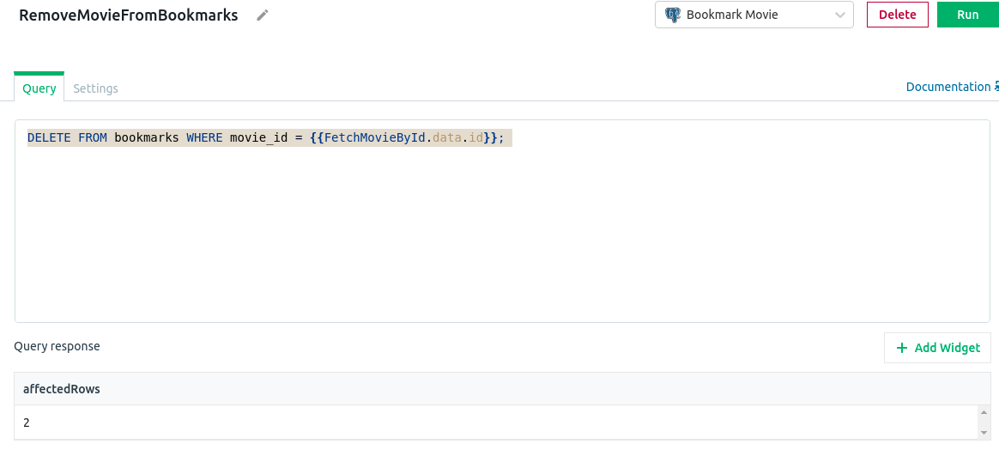

## Bookmark Movies

It would be nice if we add a way to bookmark movies. That way we can easily find our saved movies. This will be implemented by saving the bookmark data on an external database. Thankfully Appsmith supports connecting with an external Database. For this example, I'm going to use a database that is stored on AWS. Be aware that for each cloud service the setup steps can differ.

#### Setup the DB connection

1. Navigate to the MovieDetail
2. At the `DB Queries` click on the `+`
3. Now click on `New Data source`
4. Select `PostgreSQL`
5. At the `Connection Mode` let's select the `Read / Write`
6. At the `Host Address` we are going to use `database-1.cldr4xdrsovy.us-east-2.rds.amazonaws.com`
7. For the port we can add the default Postgres port: `5432`
8. For the `Database Name` we can add `appsmith`
9. At the `authentication` section we will only need to add the Username. The reason for this is because I disabled the need to pass a password on this connection. Remember that if you are going to connect your own database, these steps may be different.
10. For the `Username` we give the value `postgres`
11. Now we can simply click on `Test` and check that the setup connection was properly made

&nbsp;

Now let's create our first query

#### Add movie to Bookmarks

1. Navigate to the MovieDetail
2. At the `DB Queries` click on the `+`
3. At the `Bookmark Movie DB connection` let's click on the button `+ New Query` 

&nbsp;

4. Let's rename the query to `AddMovieToBookmarks`
5. Within the given options we can select `Create`
6. At the AWS cloud database, there is a table created with the name of `bookmarks`. The table has 2 columns: `movie_id` and `movie_title`. We want to add both values from the movie data to the bookmarks table. Let's add this query:
```JS
INSERT INTO bookmarks
  (movie_id, movie_title)
VALUES
  (
    {{FetchMovieById.data.id}}, '{{FetchMovieById.data.title.replace("'", "''")}}'
  );

```
I'm using a little bit of JS on the query to make sure that the query is escaping a simple quote on the movie title if exists.

7. Now we can test the query by clicking on the run button

&nbsp;

#### Remove movie from Bookmarks

Let's now implement a query to remove a bookmarked movie from the cloud.

1. Navigate to the MovieDetail
2. At the `DB Queries` click on the `+`
3. At the `Bookmark Movie DB connection` let's click on the button `+ New Query` 
4. Let's rename the query to `RemoveMovieFromBookmarks`
5. Within the given options we can select `Delete`
6. We can write a simple sql query to delete a row:
```JS
DELETE FROM bookmarks WHERE movie_id = {{FetchMovieById.data.id}};
```
7. Now we can test the query by clicking on the run button

&nbsp;

Now we have 2 queries already: one to add the movie to the bookmarks table and another one to remove from it. But we also need a query to check if a specific movie is on the database. So let's create it now.

#### Get Movie from Bookmarks table

1. Navigate to the MovieDetail
2. At the `DB Queries` click on the `+`
3. At the `Bookmark Movie DB connection` let's click on the button `+ New Query` 
4. Let's rename the query to `GetMovieFromBookmarks`
5. Within the given options we can select the `Select` option
6. We can write a simple SQL query to get a specific book from the table:
```JS
SELECT * FROM bookmarks where movie_id = {{appsmith.URL.queryParams.id}};
```
7. Now we can test the query by clicking on the run button

With these 3 queries, we now can move on and implement the movie bookmark functionality

#### Bookmark Functionality

1. Navigate to the `MainPage`
2. Choose a movie from your preference and click on the cover to navigate to the `MovieDetail` page
3. Now we need to make sure that we are the `MovieDetail` page
4. Navigate to the Widgets and click on the `+`
5. Click and drag a Button widget to the right side of the movie overview

This button will have 2 purposes, add the currently selected movie to the bookmarks table or remove it. What the button label is going to say depends on whether the movie is already on the bookmarks table or not. In order to achieve that, we are going to use a conditional (ternary) operator in the Label property. 

1. Access the button properties
2. At the Label property we are going to add the following code:
```JS
{{GetMovieFromBookmarks.data.filter(movie => movie.movie_id === FetchMovieById.data.id).length 
  ? "Remove from Bookmarks" 
  : "Add to Bookmarks" }}
```
This code is using the filter method from the Array class to verify if the currently selected movie at the MovieDetail page is inside the returned array from the `GetMovieFromBookmarks`. If it is, it will show `Remove from Bookmarks` message. If not, it will show `Add to Bookmarks`.

&nbsp;

Now we need to add an action to the button. This action can be to either add the movie to the bookmarks table or remove it. Since we have 2 possible scenarios here, we need to use JS again, and this code is going to be a little bit. Here is the desired code:
```JS
{{ 
  GetMovieFromBookmarks.data.filter(movie => movie.movie_id == FetchMovieById.data.id).length 
    ? RemoveMovieFromBookmarks
      .run(
        () => { 
          showAlert("Successfully removed movie from bookmarks", "success"); 
          GetMovieFromBookmarks.run() 
        }, 
        () => showAlert("Error happened while trying to remove movie from the bookmarks", "error")) 
    : AddMovieToBookmarks
    .run(() => { 
      showAlert("Successfully added movie to bookmarks", "success"); 
      GetMovieFromBookmarks
        .run() }, () => showAlert("Error happened while trying to add movie to the bookmarks",    "error")) 
}}
```

Here we are checking the 2 possible scenarios. If the movie it's on the database, we are going to run the query to remove it. An alert will appear and its message depends on whether the removal operation succeeds or not. If the operation succeeds, the query `GetMovieFromBookmarks` will run, this way the text from the button will update.
If the movie it's not on the bookmark table, the query to add it will be triggered. And once again, an alert will appear letting the user know if the operations succeed or not. Again, If the operation succeeds, the query `GetMovieFromBookmarks` will run.

&nbsp;

Awesome, we can now add and remove movies to our bookmark list. But we also need a way to show the list. We are going to implement that right now.