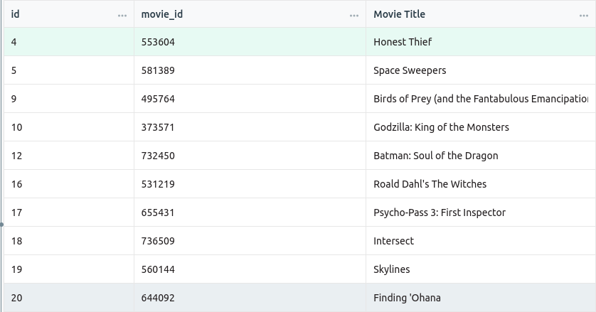
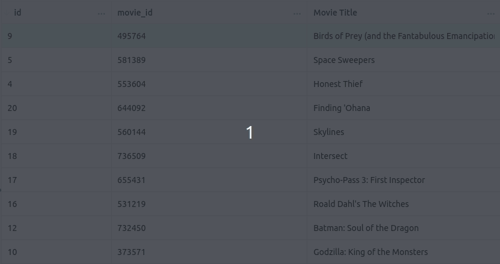
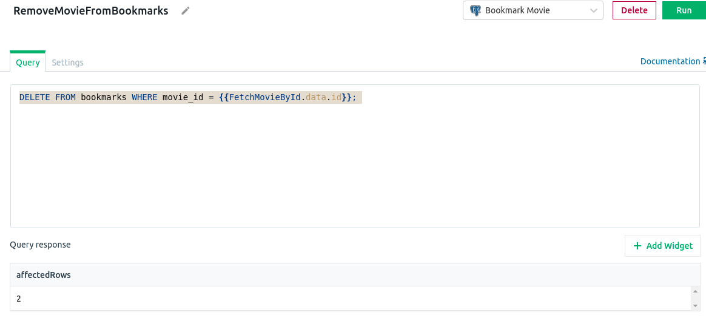
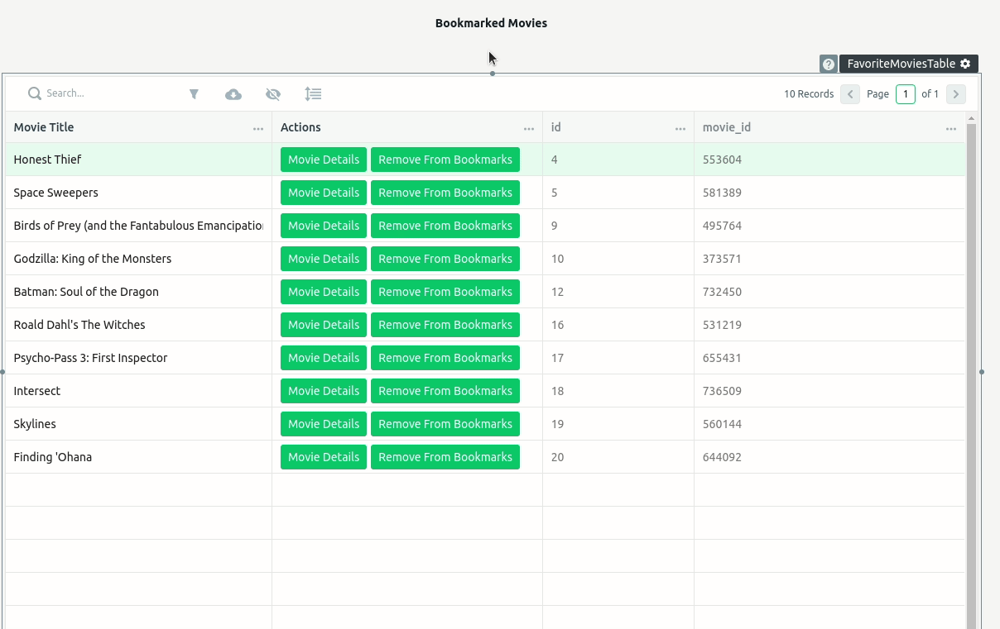
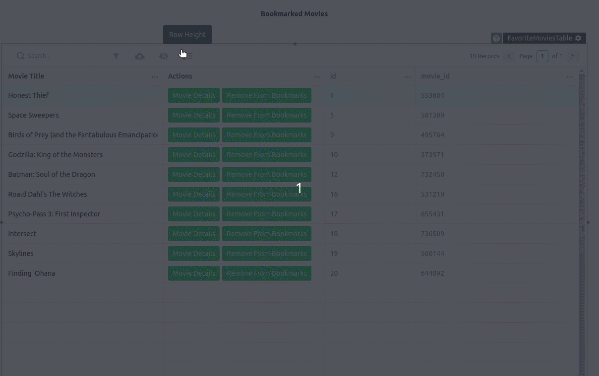

## Bookmark List

#### Adding    Bookmark List Widget

Let's create a new page where we are going to display all bookmarked movies:

1. Click on the `+` at the pages section within the left menu
2. A new page will be created. Let's double click in the `Page1` and rename it to `FavoriteMovies`
3. Now at the `FavoriteMovies` page navigate to the Widget section and click on the `+`
4. Click and drag a table widget to the page
5. let's edit its properties and rename it to `FavoriteMoviesTable`

Great, our table is now ready to display a list of movies. We now need to create a query to fetch all movies within the bookmarks table.

1. Navigate to the `DB Queries` and click on the `+`  
2. Let's click on the button `+ New Query`
3. Rename it to `GetAllBookmarksMovies`
4. On the query type select the `Select` option
5. Then we can simply add this query

```JS
SELECT * FROM bookmarks ORDER BY id;
```

With this query, we will be able to get all bookmarked movies from the database. Now let's move back to our table and load the bookmark data.

1. Navigate again to `FavoriteMovies`
2. Access the `FavoriteMoviesTable` properties
3. At the `Table Data` we can add the code:
```JS
{{GetAllBookmarksMovies.data}}
```

By using this JS we will be able to have access to all bookmarked movies

&nbsp;

You will notice the list displaying all columns from the bookmarks table. Both the `id` and `movie_id` columns have no need to appear in the list. We can hide them

1. Click on the `...` button at the right of the column name.
2. Then select the option `Hide Column`

&nbsp;

#### Movie Details Button

Let's add a button for each movie row. By clicking on this button the user will be able to navigate to the `DetailMovie` page.

1. At `FavoriteMovies` page access the properties from the `FavoriteMoviesTable`
2. Scroll down to the Actions property and click on the `+ New Button`
3. Give the name of `Movie Details`
4. At the dropdown with `No Action` value we are going to click and select the `Navigate To` option
5. At the `Page Name` we are going to change to `MovieDetail`
6. At the `Query Params` we need to pass the movie id from the selected row. We can access this value through the `FavoriteMoviesTable` list itself. The JS code will be:
```JS
{{{"id": FavoriteMoviesTable.selectedRow.movie_id}}}
```
7. And for the `Target` we can select the `Same window` value

By clicking on the button now we should be redirected to the `MovieDetail` page

#### Remove From Bookmarks Button

It would be also nice if we had a button to remove the movie from the bookmark list. First, we need to have a DB query to remove the movie from the bookmarks table. We already have a DB query for that but it is on another page. We will need to add it again for the `FavoriteMovies` page.

1. Navigate to the `FavoriteMovies`
2. At the `DB Queries` click on the `+`
3. Let's click on the button `+ New Query` 
4. Let's rename the query to RemoveMovieFromBookmarks
5. Within the given options we can select `Delete`
6. We can write a simple SQL query to delete a row:
```JS
DELETE FROM bookmarks WHERE movie_id = {{FavoriteMoviesTable.selectedRow.movie_id}}; 
```

&nbsp;

Not let's create the button and add the functionality to it.  

1. At the `FavoriteMovies` page access the properties from our list widget
2. Scroll down to the Actions property and click on the `+ New Button`
3. Give the name of `Remove From Bookmarks`
4. At the dropdown with `No Action` value we are going to click and select the `Execute a DB Query` option and in the second dropdown we select the query name, `RemoveMovieFromBookmarks`
5. At the OnSuccess property we change it to `Execute a DB Query` again, and select the `GetAllBookmarksMovies` query since we need to load the data again after removing a movie
 
 Now both functionalities are working at our Bookmarks list table.

&nbsp;

&nbsp;